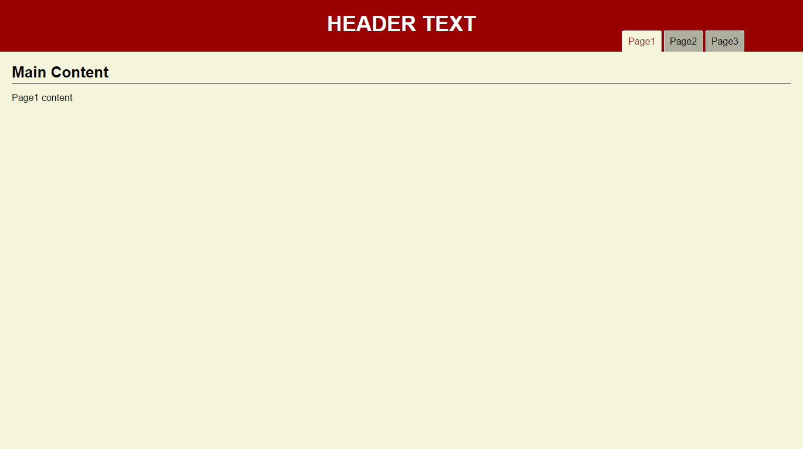
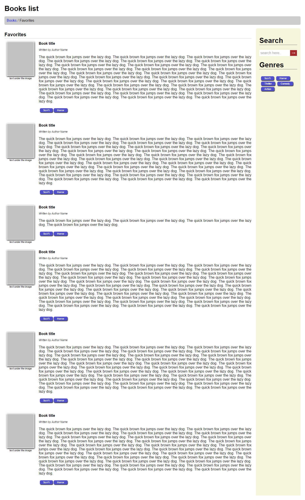

# A collection of designs I made
Partials of web page or a whole design of a site. Things I've made and like. Things that I might use in my projects.
Ideas about semantic HTML and CSS/SCSS blocks of code that are like best practices for me.

### Current Projects
[Page Header 1](page-header1/ "Page Header 1") - a main page header with a menu

[Books List](books-list/ "Books List") - a whole front page showing a list of books with header and a sidebar.

