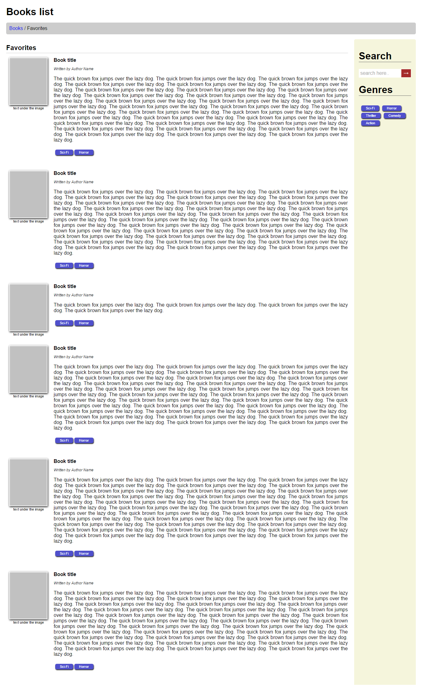

# Books List
A books list main page built with HTML5 and CSS3 with a header and a sidebar.

[Normalize.css](https://necolas.github.io/normalize.css/) is used to reset the standard dimensions. Sass is used for 
the CSS. It builds the `main.css` file in a pretty format for inspection. Together the Normalize's and the Sass 
produced code are bundled inside `bundle.css` which [index.html](index.html) uses. 
Floats are used to position most of the elements. The sidebar is taking the whole height of the page. 
Inside of it there are search and genres sections. Genres links can be of any number.
Genres are shown under the book's text in the main content. The main content also consists of a title, an author name,
an image of the book on the left. The image is inside a small white rectangular border and has a caption underneath.

[See it in action here](https://designs-collection.iliyan-trifonov.com/books-list/ "Books List").

### Install

You need [npm](https://www.npmjs.com) and [gulp](http://gulpjs.com/) to work with this project:

    npm install -g gulp
    npm install
    
Npm installs `gulp`, `gulp-clean`, `gulp-concat`, `gulp-minify-css`, `gulp-sass` and `normalize.css` in 
`node_modules/`. Gulp is used to build and watch the changes in the files. 
Running `gulp bundle` will create the final CSS bundle file:

    gulp bundle
    
After the `gulp bundle` is finished open [index.html](index.html) to see the final result.
    
### Additional commands
    
Running `gulp` only will build the files and start watching for changes:

    gulp
    
It will run `gulp bundle` on any change.
    
`gulp bundle`, `gulp build` and `gulp` commands are running the `clean` task automatically but you can run it directly with:

    gulp clean
    
It deletes the built CSS files and leaves the project with the default structure. Only the `node_modules` dir stays.
