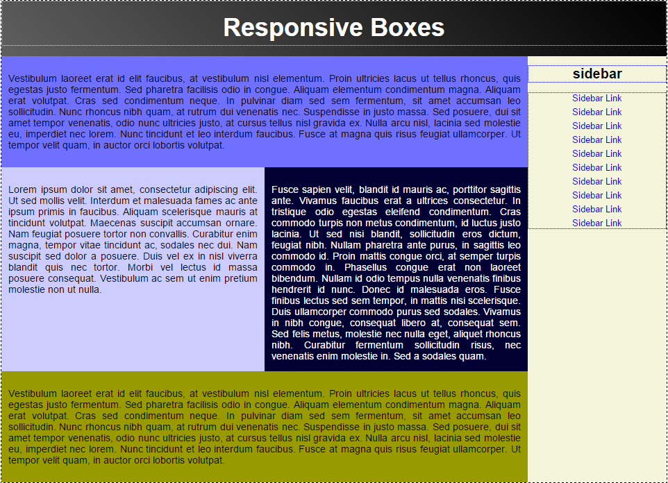

# Responsive Boxes
A page with a couple of boxes arranged as top, bottom, right side, middle. Floats are used for the sidebar and the
middle boxes to put them together next to each other. The special micro clear fix is used. Sass's color functions
are used to create close colors for better UX. Little borders and background colors are put on the elements that need 
to be seen how they are arranged and their padding/margin. There is a header with H1 in the middle. Linear gradient
is used for the header's background. The sidebar has a title and a list of links. The middle boxes are taking the full 
height available and expands with their contents. All of the boxes are width dynamic dimensions and expand/shrink with 
the size of the window. The fonts are also proportional. The sidebar height takes all of the available height.
With all this the whole page takes exactly what is needed by the inner contents without extra space. There are media
queries to provide some breaks on smaller screen and rearranges the sidebar and the content boxes. The maximum width
of the page is 960px and uses the max-width/width % configuration to shrink on smaller screens. I've decided to use
div tags exclusively for this design but most of them can be replaced with HTML5 tags for more semantic HTML.

[Normalize.css](https://necolas.github.io/normalize.css/) is used to reset the standard dimensions. Sass is used for 
the CSS. It builds the `main.css` file in a pretty format for inspection. Together the Normalize's and the Sass 
produced code are bundled inside `bundle.css` which [index.html](index.html) uses. 

[See it in action here](https://designs-collection.iliyan-trifonov.com/responsive-boxes/ "Responsive Boxes").

### Install

You need [npm](https://www.npmjs.com) and [gulp](http://gulpjs.com/) to work with this project:

    npm install -g gulp
    npm install
    
Npm installs `gulp`, `gulp-clean`, `gulp-concat`, `gulp-minify-css`, `gulp-sass` and `normalize.css` in 
`node_modules/`. Gulp is used to build and watch the changes in the files. 
Running `gulp bundle` will create the final CSS bundle file:

    gulp bundle
    
After the `gulp bundle` is finished open [index.html](index.html) to see the final result.
    
### Additional commands
    
Running `gulp` only will build the files and start watching for changes:

    gulp
    
It will run `gulp bundle` on any change.
    
`gulp bundle`, `gulp build` and `gulp` commands are running the `clean` task automatically but you can run it directly 
with:

    gulp clean
    
It deletes the built CSS files and leaves the project with the default structure. Only the `node_modules` dir stays.

### TODO

Make the sidebar on smaller screens activated with a button with some JS code to handle the behaviour.
Or position the sidebar horizontally under the header. Or position it under the header with vertical links on new lines.
